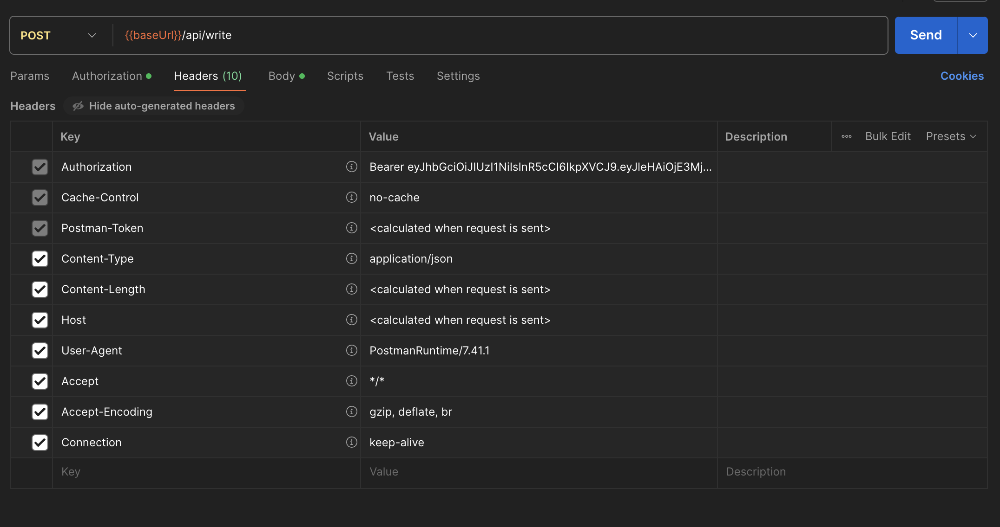
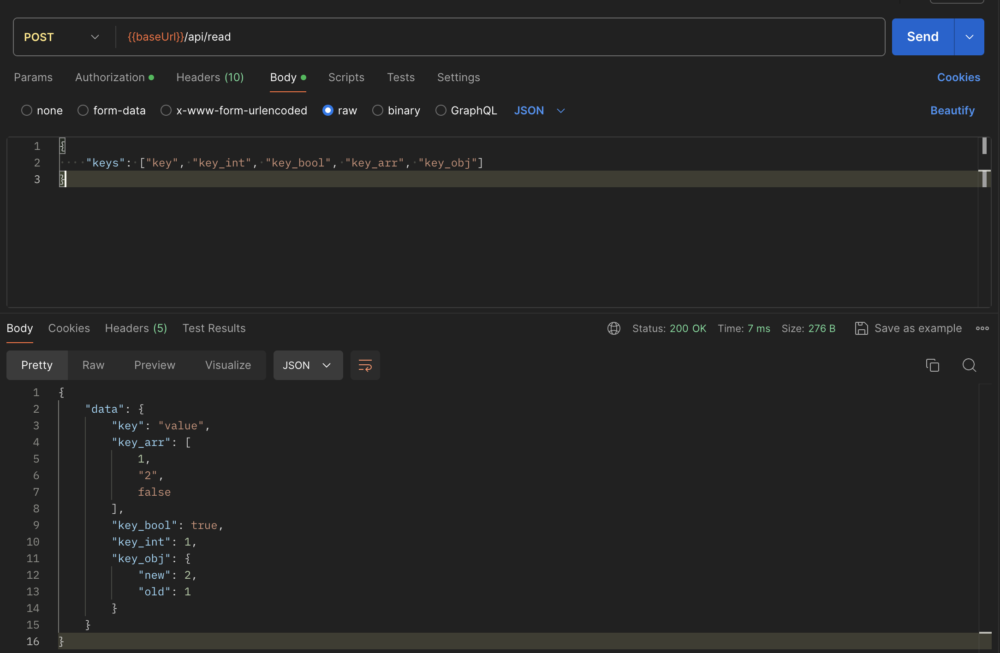

# KV хранилище на базе Tarantool
## Описание задания

Реализовать API для KV-хранилища на базе Tarantool.

## Описание API

Зарегистрированы следующие эндпоинты:

* POST /api/login - для получения токена авторизации
* POST /api/write - для записи данных пачками
* POST /api/read - для чтения данных пачками

Схема API представлена в файле [openapi.yaml](api/openapi.yaml)

## Запуск проекта

1. Необходимо создать .env файл с помощью команды

```shell
make env
```

В файле может задать следующие параметры

TARANTOOL_USER_NAME - логин администратора Tarantool
TARANTOOL_USER_PASSWORD - пароль администратора
TARANTOOL_PORT - порт Tarantool
TARANTOOL_REQUEST_TIMEOUT - таймаут на исполнение запроса к Tarantool

APP_PORT - порт сервиса
APP_HOST - хост сервиса 
TOKEN_TTL - время жизни токена аутентификации
APP_SECRET_KEY - секретный ключ приложения для JWT
TARANTOOL_ADDRESS=tarantool:4000 - адрес TARANTOOL для приложения

2. Запустить контейнеры docker 

```shell
make deploy
```

## Тестирование приложения

Приложение использует протокол HTTP для обмена данными между сервером и клиентом.
В качестве токена авторизации используются JWT токены.

Примеры запросов показаны на рисунках ниже:

Все запросы имеют валидацию `json`


У запросов к `/write` и `/read` должен указываться токен для доступа к данным, иначе система не пропустит запрос.

Стандартные хедеры:



Ответы при невалидном токене:


1) Запросы к `/login`


------

Запросы к `/read`




